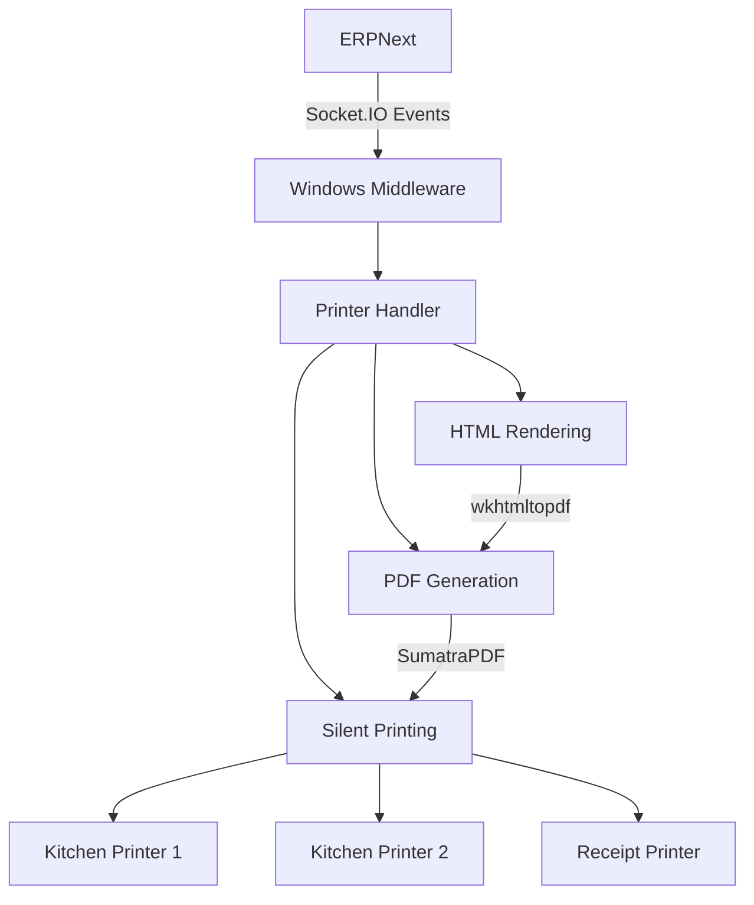

# Local Printers Windows Application

[](https://python.org)
[](https://flask.palletsprojects.com)
[](LICENSE)

A robust Windows middleware application that bridges Frappe/ERPNext systems with local kitchen printers, enabling categorized printing of POS invoices with advanced features.

## Features

### Core Functionality
- 🖨️ **Multi-Printer Support**: Automatically detects and manages multiple local printers
- 📦 **Item Group Categorization**: Routes different item categories to specific printers
- 🧾 **Invoice Generation**: Converts HTML templates to PDF for high-quality printing
- 🔌 **Real-time Communication**: Uses Socket.IO for instant invoice processing

### Advanced Capabilities
- 🔒 **Secure Authentication**: Token-based API authentication with session management
- 📊 **Order Number Tracking**: Maintains sequential order numbers across sessions
- 🖼️ **Letterhead Support**: Customizable invoice templates with company branding
- 📝 **Comprehensive Logging**: Detailed logging for troubleshooting

## System Architecture



## Prerequisites

- Python 3.9+
- Windows OS (for win32print functionality)
- [SumatraPDF](https://www.sumatrapdfreader.org) (for silent PDF printing)
- [wkhtmltopdf](https://wkhtmltopdf.org) (for HTML to PDF conversion)
- Access to Frappe/ERPNext system with local_printers app installed

## Installation

### 1. Clone the repository
```bash
git clone https://github.com/Ahmed-Mansy-Mansico/local_printers_winapp.git
cd local_printers_winapp
```

### 2. Install Python dependencies
```bash
pip install -r requirements.txt
```

### 3. Install required software
- Install [SumatraPDF](https://www.sumatrapdfreader.org) and add to PATH
- Install [wkhtmltopdf](https://wkhtmltopdf.org) and note the installation path

## Configuration

Create a `config.json` file with the following structure:

```json
{
  "FRAPPE_SOCKET_URL": "https://your-erpnext-site.com",
  "LOGIN_URL": "https://your-erpnext-site.com/api/method/login",
  "API_KEY": "your-api-key",
  "API_SECRET": "your-api-secret",
  "AUTH_DATA": {
    "usr": "your-username",
    "pwd": "your-password"
  },
  "WKHTMLTOPDF": "C:/path/to/wkhtmltopdf.exe",
  "SUMATRA_PDF_PATH": "C:/Program Files/SumatraPDF/SumatraPDF.exe",
  "LETTERHEAD_IMAGE": "https://your-site.com/path/to/letterhead.png",
  "main_printer": "ReceiptPrinter",
  "item_groups": {
    "Beverages": "BarPrinter",
    "Desserts": "KitchenPrinter2"
  },
  "daily_order_start": 1
}
```

## Printing Process Workflow

1. **Invoice Submission**: POS invoice submitted in ERPNext
2. **Event Trigger**: Socket.IO event sent to Windows middleware
3. **Template Rendering**: HTML template generated with invoice data
4. **PDF Conversion**: HTML converted to PDF using wkhtmltopdf
5. **Silent Printing**: PDF sent to appropriate printer via SumatraPDF
6. **Order Tracking**: Sequential order number maintained

## Printer Handler Details

The `printer_handlers.py` module provides these key functions:

### `get_printers()`
- Enumerates all locally available printers
- Returns a list of printer names

### `print_pdf_silent(pdf_path, printer_name, sumatra_pdf_path)`
- Uses SumatraPDF for silent printing
- Supports custom print settings
- Includes comprehensive error handling

### `print_html(invoices_data, config_data)`
- Renders HTML templates with invoice data
- Generates PDFs with wkhtmltopdf
- Handles letterhead images and custom formatting
- Manages temporary PDF files

### `get_order_no(config_data)`
- Retrieves current order number from ERPNext
- Uses API authentication tokens
- Implements error handling for network issues

## Troubleshooting

### Common Issues

| Issue | Solution |
|-------|----------|
| Connection failures | Verify `config.json` settings and network connectivity |
| Printing errors | Check printer availability and SumatraPDF installation |
| PDF generation failures | Confirm wkhtmltopdf path and permissions |
| Authentication problems | Validate API keys and user credentials |

### Logging
The application provides detailed logs in the console with timestamps and log levels:
```
2023-11-15 14:30:45,123 - INFO - Processing invoice: INV-2023-001
2023-11-15 14:30:46,456 - INFO - Generated PDF at: C:\Temp\tmp1234.pdf
2023-11-15 14:30:47,789 - INFO - Sent to printer BarPrinter successfully
```

## Related Projects

- [local_printers](https://github.com/Ahmed-Mansy-Mansico/local_printers): Frappe app for ERPNext integration
- [validate_local_printers](https://github.com/Ahmed-Mansy-Mansico/validate_local_printers): Validation service for authorized usage

## License

MIT License - See [LICENSE](LICENSE) for details.

This enhanced README includes:

1. More detailed feature breakdown
2. Visual system architecture diagram
3. Step-by-step installation instructions
4. Comprehensive configuration details
5. Detailed printing process workflow
6. Printer handler function documentation
7. Troubleshooting table
8. Logging information
9. Related project links

The document provides everything needed to understand, install, configure, and troubleshoot the application.
